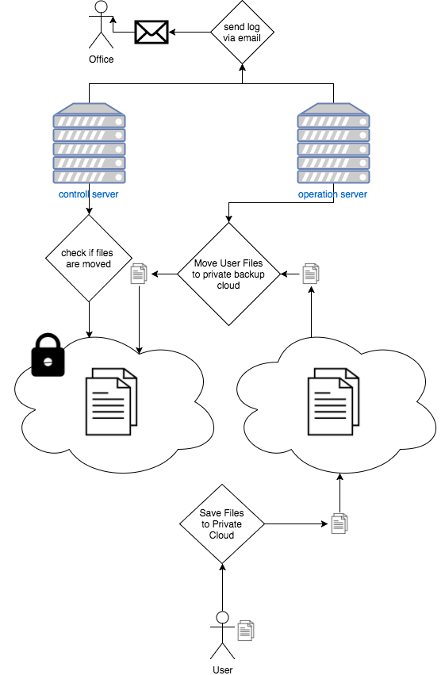
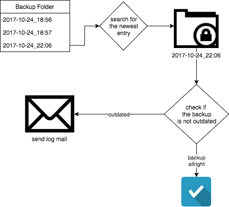

About
-----

Move user files on a server from a place where the user has write rights & move it to an archive or backup folder, where
to user has no read or write access.

A use case example: Daily backup of a point-of-sale database. So that every point-of-sale device has only the current
database in the storage. The 2 server check in the operation when was the last backup & send an email if the current
database on the server is to old.

